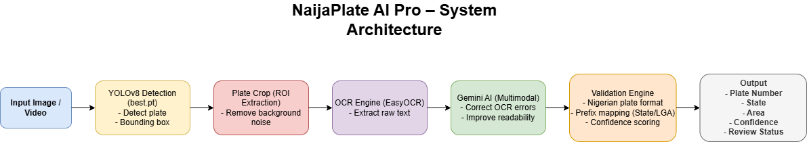
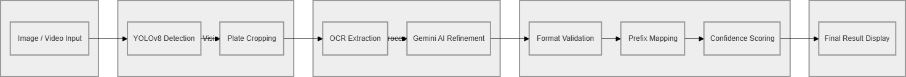
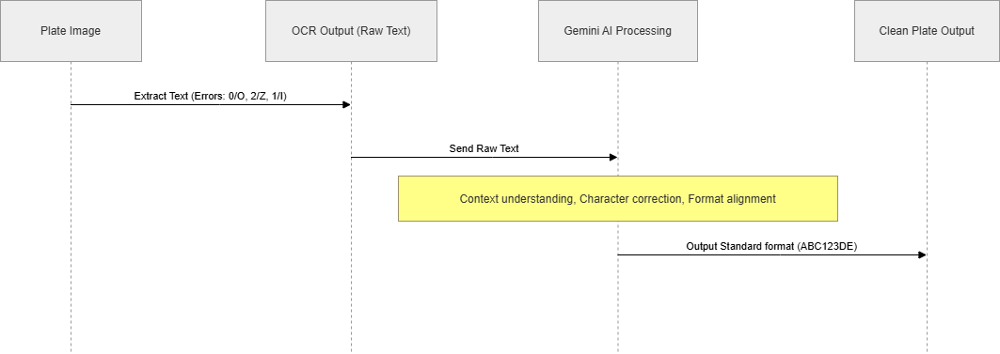

title: NaijaPlate
emoji: 🚗
colorFrom: blue
colorTo: indigo
sdk: docker
pinned: false
-------------

# 🚗 NaijaPlate AI Pro

## AI-Powered Nigerian License Plate Detection & Recognition System

NaijaPlate AI Pro is a localized AI-powered computer vision system designed to accurately detect, extract, validate, and recognize Nigerian vehicle license plates under real-world conditions.

The system combines:

* YOLOv8 Object Detection
* OCR Text Extraction
* Google Gemini AI Refinement
* Rule-Based Validation Engine
* Confidence Scoring Engine

The result is a production-ready Nigerian Automatic Number Plate Recognition (ANPR) system optimized for local environments.

---

## 🌐 Live Deployments

### 🖥️ Frontend Application — Vercel

🔗 https://naija-plate-ai-pro.vercel.app/

The frontend provides:

* Image upload interface
* Detection visualization
* Plate analysis display
* Real-time interaction with backend services

---

### ⚙️ Backend API Service — Render

🔗 https://naijaplate-ai-pro.onrender.com

The backend handles:

* API orchestration
* File upload processing
* Request validation
* Communication with the ML inference engine
* Structured response formatting

---

### 🤖 ML Inference Service — Hugging Face Spaces

Hugging Face Space:

🔗 https://huggingface.co/spaces/Hardecomm/NaijaPlate

Direct ML Runtime Endpoint:

🔗 https://hardecomm-naijaplate.hf.space

The ML service handles:

* YOLOv8 plate detection
* OCR extraction
* Gemini AI refinement
* Nigerian plate validation
* Confidence scoring
* Video frame analysis

---

## 🔍 Overview

Traditional plate recognition systems struggle in Nigerian environments because of:

* Motion blur
* Low lighting
* Dirty plates
* OCR inaccuracies
* Non-standard plate positioning
* Environmental noise

NaijaPlate AI Pro introduces a layered AI pipeline that improves reliability using:

```text
Computer Vision + OCR + Generative AI + Rule-Based Validation
```

---

## ❗ Problem Statement

Vehicle identification in Nigeria is often:

* Manual
* Slow
* Error-prone
* Difficult to scale

Generic OCR systems fail to properly understand:

* Nigerian plate structures
* State prefixes
* Plate slogans
* Contextual corrections
* Real-world lighting and motion conditions

This leads to:

* Incorrect plate readings
* Wrong state inference
* Unreliable automation
* Poor deployment readiness for smart city and traffic systems

---

## ✅ Solution

NaijaPlate AI Pro uses a multi-stage intelligent pipeline:

```text
Input → Detection → Crop → OCR → Gemini AI → Validation → Output
```

The system performs:

* Accurate plate localization
* Focused region extraction
* OCR text recognition
* AI-assisted correction
* Nigerian state inference
* Confidence scoring
* Structured JSON output

---

## 🧩 System Architecture



---

## 🧠 Layered Pipeline



---

## 🤖 OCR + Gemini Enhancement



---

## ⚙️ How It Works

### 🔄 Pipeline Flow

```text
Input Image / Video
        ↓
YOLOv8 Plate Detection
        ↓
Plate Crop / ROI Extraction
        ↓
OCR Text Extraction
        ↓
Gemini AI Refinement
        ↓
Nigerian Plate Validation
        ↓
Final Structured Output
```

---

### 1️⃣ Input Image


---

### 2️⃣ Plate Detection


YOLOv8 detects the license plate using bounding box localization.

---

### 3️⃣ Plate Crop


The detected plate region is cropped for focused OCR processing.

---

### 4️⃣ OCR Extraction

EasyOCR extracts raw text from the cropped plate.

Example raw OCR output:

```text
0 auuin Yab6s2CH
```

Common OCR errors include:

* `0` mistaken for `O`
* `2` mistaken for `Z`
* `1` mistaken for `I`
* `5` mistaken for `S`
* Plate slogan or state text mixed with plate number

---

### 5️⃣ Gemini AI Refinement

Google Gemini AI refines noisy OCR output using Nigerian plate context.

Example:

```text
Raw OCR:        Yab6s2CH
Refined Plate: YAB-652CH
Correct State: ABUJA
```

Gemini helps correct:

* Character confusion
* OCR distortion
* Contextual state mismatch
* Invalid formatting
* Noisy plate text extraction

---

### 6️⃣ Validation Engine

The validation engine checks:

* Nigerian plate format
* State prefix consistency
* Plate structure
* Confidence level
* AI-corrected output reliability

---

## 📊 Example JSON Output

```json
{
  "plate": "YAB-652CH",
  "final_state": "ABUJA",
  "confidence": "HIGH_CONFIDENCE_AI",
  "sources": {
    "ocr_raw": "0 auuin Yab6s2CH",
    "ocr_interpretation": {
      "state": "LAGOS",
      "area": "Yaba",
      "note": "Incorrect due to OCR prefix misinterpretation"
    },
    "gemini_output": {
      "state": "ABUJA",
      "number": "YAB-652CH",
      "slogan": "CENTRE OF UNITY"
    }
  },
  "decision": {
    "final_state_source": "gemini_output",
    "reason": "Gemini corrected OCR error using contextual knowledge"
  }
}
```

---

## 🧠 Key Insight

OCR alone is not reliable for real-world Nigerian plate recognition.

NaijaPlate AI Pro improves accuracy by combining:

* Computer Vision
* OCR extraction
* Generative AI reasoning
* Rule-based validation
* Confidence scoring

Result:

✅ More reliable Nigerian license plate recognition under difficult real-world conditions.

---

## 🧠 Key Features

* 🇳🇬 Nigerian license plate localization
* 🤖 AI-powered OCR correction
* 📍 Prefix-based state inference
* 📊 Confidence scoring
* 📦 Structured JSON API output
* 🎥 Image and video support
* ⚡ Real-time inference architecture
* ☁️ Cloud-deployed ML inference service

---

## 🧩 Production Deployment Architecture

NaijaPlate AI Pro uses a distributed modern AI architecture.

```text
Frontend (Vercel)
https://naija-plate-ai-pro.vercel.app/
        ↓
Backend API (Render)
https://naijaplate-ai-pro.onrender.com
        ↓
ML Inference Service (Hugging Face Spaces)
https://hardecomm-naijaplate.hf.space
```

---

## 🖥️ Frontend Deployment — Vercel

The frontend UI is deployed on Vercel.

### Responsibilities

* Image upload interface
* Detection preview
* Prediction result display
* User interaction
* API communication with Render backend

### Stack

* React
* Vite
* Axios
* Tailwind CSS

---

## ⚙️ Backend Deployment — Render

The backend API orchestration layer is deployed on Render.

### Responsibilities

* Request handling
* Upload processing
* API routing
* Middleware
* Communication with Hugging Face ML service
* Response formatting
* Error handling

### Stack

* Node.js
* Express.js
* Multer
* Axios

---

## 🤖 ML Inference Deployment — Hugging Face Spaces

The ML engine is independently deployed on Hugging Face Spaces using Docker.

### Live ML Service

https://huggingface.co/spaces/Hardecomm/NaijaPlate

### Direct Runtime Endpoint

https://hardecomm-naijaplate.hf.space

### Responsibilities

* YOLOv8 inference
* OCR processing
* Gemini AI refinement
* Plate validation
* Confidence scoring
* Video frame analysis
* Structured JSON response

### ML Stack

* Python
* YOLOv8
* EasyOCR
* OpenCV
* Google Gemini AI
* Docker

---

## ⚡ Why This Architecture?

This architecture improves:

* Scalability
* Maintainability
* Deployment stability
* ML workload isolation
* Frontend performance
* Backend flexibility
* AI inference reliability

Each layer can scale independently:

```text
Frontend → Vercel
Backend → Render
ML Inference → Hugging Face Spaces
```

This mirrors real-world AI system design where frontend, backend, and ML inference services are separated for better performance and maintainability.

---

## 🔌 API Communication

### Frontend → Backend

```javascript
const API_BASE_URL = "https://naijaplate-ai-pro.onrender.com";
```

### Backend → ML Service

```javascript
const ML_SERVICE_URL = "https://hardecomm-naijaplate.hf.space";
```

---

## 📡 ML Service Health Endpoint

```text
GET /
```

Response:

```json
{
  "status": "ok",
  "service": "NaijaPlate ML Service",
  "message": "YOLO/OCR service is running"
}
```

This confirms:

* Docker deployment successful
* ML service is running
* YOLO/OCR service initialized
* Hugging Face runtime is active

---

## 🧠 Tech Stack

### Frontend

* React
* Vite
* Tailwind CSS
* Axios

### Backend

* Node.js
* Express.js
* Multer
* Axios

### AI & ML

* Python
* YOLOv8
* EasyOCR
* OpenCV
* Google Gemini AI

### Deployment

* Vercel
* Render
* Hugging Face Spaces
* Docker

---

## 📂 Project Structure

```text
NaijaPlate/
│
├── frontend/
│   ├── src/
│   ├── public/
│   ├── package.json
│   └── vite.config.js
│
├── backend/
│   ├── controllers/
│   ├── routes/
│   ├── middleware/
│   ├── server.js
│   └── package.json
│
├── ml-service/
│   ├── app.py
│   ├── Dockerfile
│   ├── requirements.txt
│   │
│   └── python_engine/
│       ├── config/
│       │   ├── paths.py
│       │   └── settings.py
│       │
│       ├── core/
│       │   ├── ai_refiner.py
│       │   ├── constants.py
│       │   ├── cropper.py
│       │   ├── detector.py
│       │   ├── ocr_engine.py
│       │   ├── pipeline.py
│       │   ├── plate_selector.py
│       │   ├── plate_zone.py
│       │   ├── prefix_mapper.py
│       │   ├── text_cleaner.py
│       │   ├── video_box_reuse.py
│       │   ├── video_pipeline.py
│       │   └── video_tracker.py
│       │
│       ├── models/
│       │   └── best.pt
│       │
│       ├── main.py
│       └── requirements.txt
│
├── docs/
│   ├── architecture.png
│   ├── layered.png
│   ├── ocr_enhancement.png
│   │
│   └── demo_images/
│       ├── input.jpg
│       ├── detection.jpg
│       └── crop.jpg
│
└── README.md
```

---

## 🚀 Real-World Applications

NaijaPlate AI Pro can support:

* 🚓 Law enforcement systems
* 🚦 Smart traffic systems
* 🏢 Estate gate automation
* 📦 Logistics and fleet verification
* 🅿️ Smart parking systems
* 🚘 Vehicle verification platforms
* 🏙️ Smart city infrastructure

---

## 🌍 Real-World Impact

NaijaPlate AI Pro improves:

* Vehicle identification speed
* Automation reliability
* Traffic monitoring efficiency
* Security checkpoint verification
* Localized AI adoption in Nigeria

It demonstrates how AI can be adapted to Nigerian-specific challenges instead of depending only on generic foreign OCR systems.

---

## ⚠️ Current Challenges

* Motion blur in moving vehicles
* Night-time detection
* Low-resolution images
* OCR inconsistency
* Video frame instability
* Deployment cost for large-scale GPU inference

---

## 🔮 Future Improvements

* Multi-frame voting for video inference
* Real-time CCTV integration
* GPU inference optimization
* Vehicle re-identification
* Traffic analytics dashboard
* Async inference queues
* Multi-camera processing
* Plate segmentation improvements
* Mobile-friendly inspection mode

---

## 👤 Author

### Haruna Adegoke Ademoye

AI/ML Engineer • Computer Vision Engineer • Backend Developer

📍 Lagos, Nigeria

LinkedIn: https://linkedin.com/in/haruna-ademoye-859486110

Portfolio: https://professiona-portfolio.netlify.app/

GitHub: https://github.com/HARDECOMM

---

## 💡 Final Note

NaijaPlate AI Pro demonstrates how localized AI systems can solve real-world African mobility, surveillance, and vehicle identification problems using:

```text
Computer Vision + OCR + Generative AI
```

This project represents a strong foundation for:

* Smart city systems
* AI surveillance
* Intelligent transportation
* Automated vehicle verification
* Real-time Nigerian ANPR infrastructure
